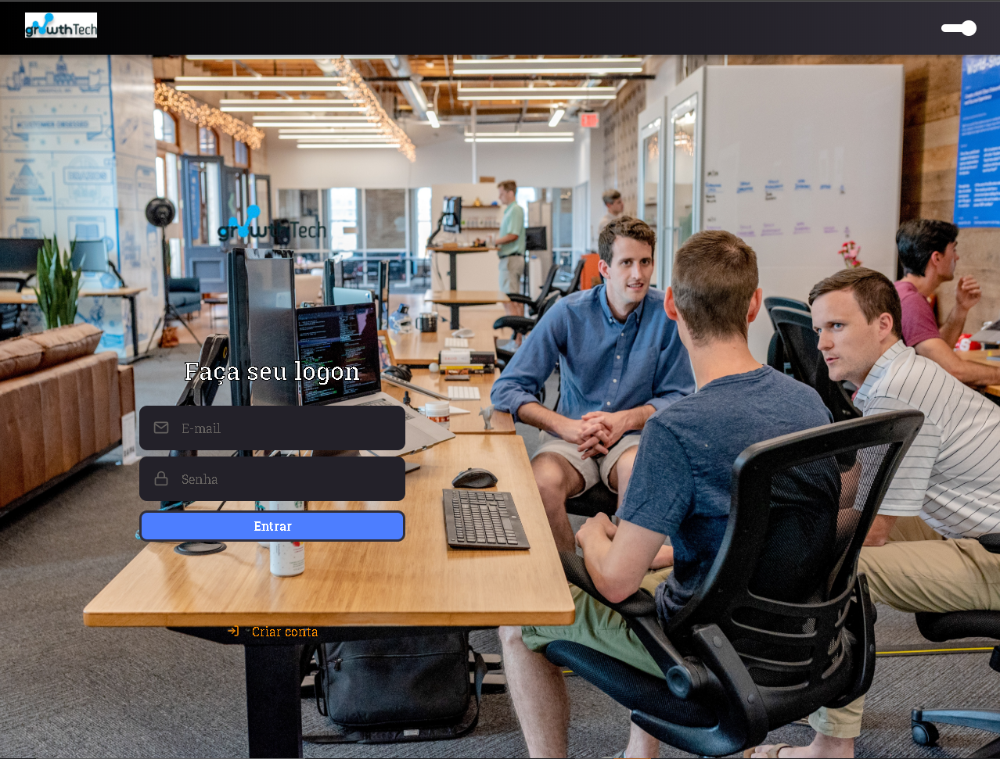
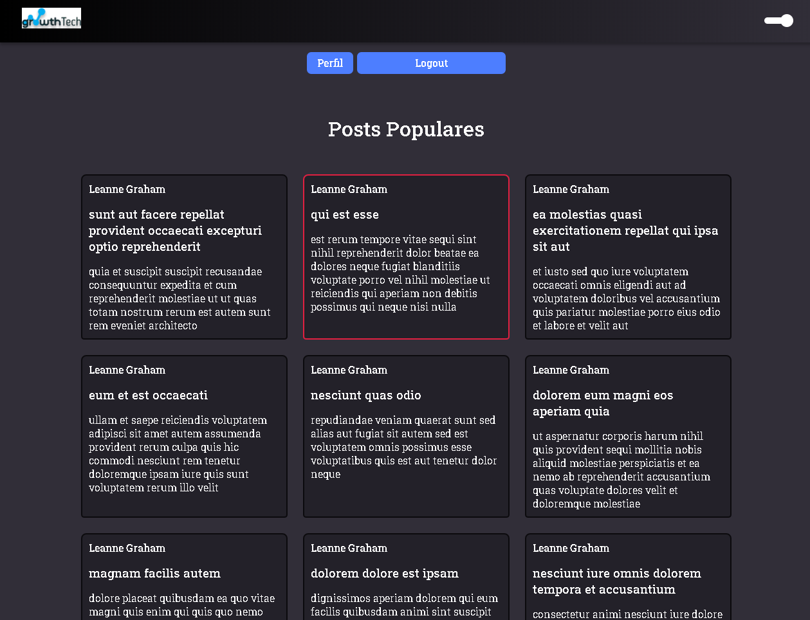
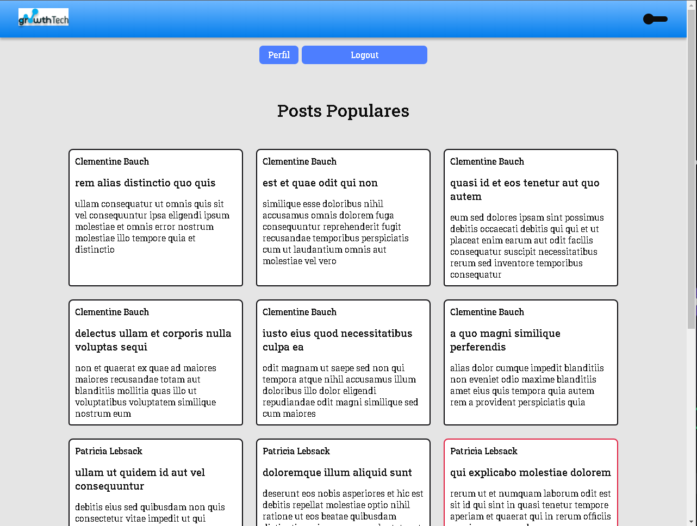
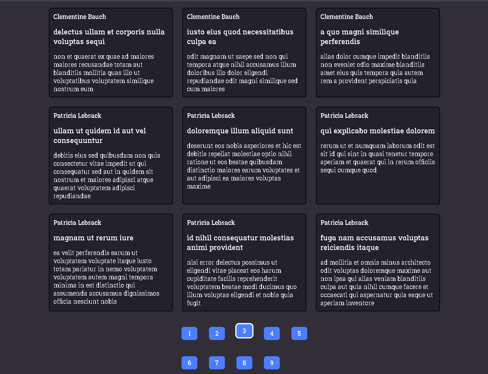

<h1 align="center">
<br>
  
<br>
</h1>

<p align="center">Application to monitor other business groups. Displaying users' posts. With a Theme Switcher.</p>

# 📷 Demo 

<div align="center" >
  
  
  
  
  
</div>

---

## 🚀 Technologies

This project was developed with the following technologies:

- ✔️ Typescript

- ✔️ ReactJS

- ✔️ NodeJS

- ✔️ Express.js

- ✔️ React Hooks

- ✔️ Context API

- ✔️ Styled-components

- ✔️ React Spring

- ✔️ Polished

- ✔️ Docker

- ✔️ PostgreSQL

- ✔️ Axios

- ✔️ JWT

- ✔️ uuid V4

- ✔️ Eslint

- ✔️ Prettier

- ✔️ Editor Config


### Requirements

- [Node.js](https://nodejs.org/en/)
- [Yarn](https://classic.yarnpkg.com/) or [npm](https://www.npmjs.com/)
- One instance of [PostgreSQL](https://www.postgresql.org/)

> Obs.: I recommend use docker

**Clone the project and access the folder**

```bash
$ git clone ... && cd GrowtTech
```

**Follow the steps below**

## Backend

```bash
# Go to the backend folder
$ cd backend

# Install the dependencies
$ yarn

# Make a copy of '.env.example' to '.env'
# and set with YOUR environment variables.
$ cp .env.example .env

# Create the instance of postgreSQL using docker
$  docker run --name growthTechApc -e POSTGRES_PASSWORD=postgres -p 5432:5432 -d postgres

# Once the services are running, run the migrations
$ yarn typeorm migration:run

# To finish, run the api service
$ yarn dev:server

# Well done, project is started!
```

## Web 

```bash
# Install the dependencies
$ yarn

# Start the client
$ yarn start
```

Made with 💜 by ARTHUR PC 👋 [See my linkedin](https://www.linkedin.com/in/arthurpc03/)
<br>

[See my youtube channel](https://www.youtube.com/c/arthurpc)